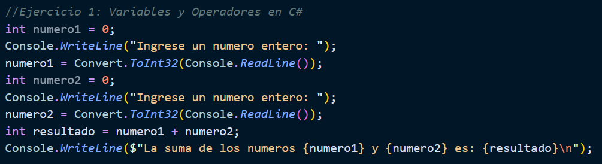
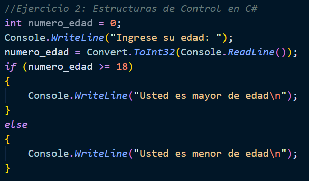
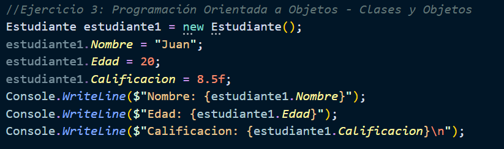
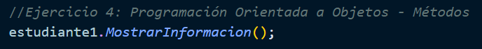
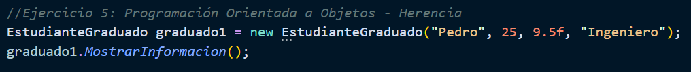

# Evaluación Primer Parcial

<aside>
📖 Universidad de las Fuerzas Armadas - ESPE
Realizado por:
✅ Cristian Tello
13 de diciembre de 2023
🖥️ Desarrollo Web Avanzado - NRC: 14956
🖥️ Docente: **Lcdo. Diego Medardo Saavedra García. Mgtr.**

</aside>

Índice

# Configuración del Proyecto:

El proyecto esta desarrollado en el entorno de .Net, por lo cuál, se debe tener instalado .Net en el ordenador para que el proyecto se ejecute. A partir de aquí, abrimos la carpeta del proyecto desde la terminal y escribimos el siguiente comando:

```json
dotnet run
```

Damos enter y el proyecto se compilará y ejecutará.

En el proyecto la autenticación se debe realizar para ejecutar el método de eliminar un producto, es decir, el usuario debe iniciar sesión como administrador para poder eliminar un producto de la base de datos.

# Directrices del Proyecto

## Ejercicio 1: Variables y Operadores en C#

1. Declarar dos variables, numero1 y numero2, e inicialízalas con valores numéricos.
2. Calcula la suma de estas dos variables y almacena el resultado en una tercera
   variable llamada resultado.
3. Imprime en la consola el valor de resultado.



## Ejercicio 2: Estructuras de Control en C#

1. Declara una variable edad e inicialízala con un valor numérico.
2. Utiliza una estructura if para determinar si la persona es mayor de edad (mayor o
   igual a 18).
3. Imprime en la consola un mensaje indicando si la persona es mayor de edad o no.



## Ejercicio 3: Programación Orientada a Objetos - Clases y Objetos

1. Crea una clase llamada Estudiante con propiedades como Nombre, Edad y
   Calificacion.
2. Crea un objeto de tipo Estudiante llamado estudiante1 e inicializa sus
   propiedades con valores ficticios.
3. Imprime en la consola la información del estudiante.



## Ejercicio 4: Programación Orientada a Objetos - Métodos

1. Amplía la clase Estudiante con un método llamado MostrarInformacion que
   imprima en la consola los detalles del estudiante.
2. Llama al método MostrarInformacion para el objeto estudiante1 y observa la
   salida.



## Ejercicio 5: Programación Orientada a Objetos - Herencia

1. Crea una nueva clase llamada EstudianteGraduado que herede de la clase
   Estudiante.
2. Añade una nueva propiedad a EstudianteGraduado llamada Titulo que
   almacene el título obtenido.
3. Crea un objeto de tipo EstudianteGraduado llamado graduado1 e inicializa sus
   propiedades.
4. Utiliza el método MostrarInformacion de la clase base para mostrar la
   información del estudiante graduado.



# Preguntas

## ¿Cuál es la diferencia entre una variable y una propiedad en C#?

Una variable en C# es un contenedor que almacena un valor mientras se ejecuta un programa. Puede ser declarada y utilizada dentro de un método o bloque de código.

Por otro lado, una propiedad en C# es una forma de encapsular valores dentro de una clase. Proporciona acceso controlado a los datos de un objeto y puede tener lógica adicional para su lectura y escritura.

## Explica cómo funciona la estructura if y por qué es útil en programación.

La estructura "if" en programación es una forma de controlar el flujo del programa basado en una condición. Funciona evaluando una expresión booleana y ejecutando un bloque de código si la condición es verdadera.

La estructura "if" es útil en programación porque nos permite tomar decisiones y ejecutar diferentes bloques de código según las condiciones que se cumplan. Por ejemplo, en el ejemplo propuesto si la edad es mayor que 18 se cumple la condición y se envía un mensaje.

## ¿Qué ventajas ofrece la programación orientada a objetos en comparación con otros paradigmas de programación?

La programación orientada a objetos (POO) ofrece varias ventajas en comparación con otros paradigmas de programación. Una de las principales ventajas es la capacidad de modelar el mundo real de manera más precisa y natural. La POO permite representar entidades y objetos del mundo real como clases, lo que facilita la comprensión y el diseño del código.

Otra ventaja de la POO es la reutilización de código. A través de la herencia y la creación de clases base, es posible crear jerarquías de clases y utilizar métodos y propiedades comunes en varias clases. Esto ahorra tiempo y esfuerzo al no tener que volver a escribir el mismo código una y otra vez.

## ¿Cuándo usarías la herencia en un diseño de clases?

La herencia en un diseño de clases se utiliza en el contexto de la Programación Orientada a Objetos (POO) cuando se desea establecer una relación de jerarquía entre clases. Se utiliza cuando hay una relación "es un" entre dos o más clases, lo que significa que una clase es una versión especializada o derivada de otra clase base.

La herencia permite aprovechar el código y la funcionalidad de una clase base en las clases derivadas. Esto significa que las clases derivadas heredan las propiedades y los métodos de la clase base, lo que evita la duplicación de código y promueve la reutilización.

## ¿Por qué es importante la encapsulación en programación orientada a objetos?

La encapsulación se refiere a la combinación de datos y comportamientos en una sola entidad, llamada clase. La encapsulación permite ocultar los detalles internos de una clase y proporciona una interfaz controlada para acceder y manipular los datos.

La importancia de la encapsulación en la POO se puede resumir en los siguientes puntos:

1. **Protección de datos**: La encapsulación permite definir la visibilidad de los datos de una clase, lo que significa que se pueden establecer niveles de acceso para proteger los datos sensibles.
2. **Modularidad y mantenibilidad**: Al encapsular datos y comportamientos relacionados en una clase, se mejora la modularidad del código. Esto significa que los cambios en una parte del código no afectarán directamente a otras partes del programa, lo que facilita el mantenimiento del código a largo plazo.
3. **Reutilización de código**: Al ocultar los detalles internos de una clase, se puede utilizar como un componente independiente en otros programas o proyectos. Esto evita la duplicación de código y mejora la eficiencia y mantenibilidad del código.

# Conclusiones

En resumen, el proyecto abarcó temas fundamentales en programación, como variables y operadores en C#, estructuras de control, programación orientada a objetos y herencia. Estos conceptos son esenciales para comprender los fundamentos de la programación y sentar las bases para desarrollar aplicaciones más complejas en el futuro.

Además, se destacó la importancia de la encapsulación en la programación orientada a objetos, ya que permite proteger los datos, mejorar la modularidad y facilitar la reutilización de código.

Finalmente, se resaltó la utilidad de la estructura "if" en programación, la cual permite controlar el flujo del programa basado en condiciones lógicas. Esta estructura resulta especialmente útil para tomar decisiones y ejecutar diferentes bloques de código según las condiciones establecidas.
